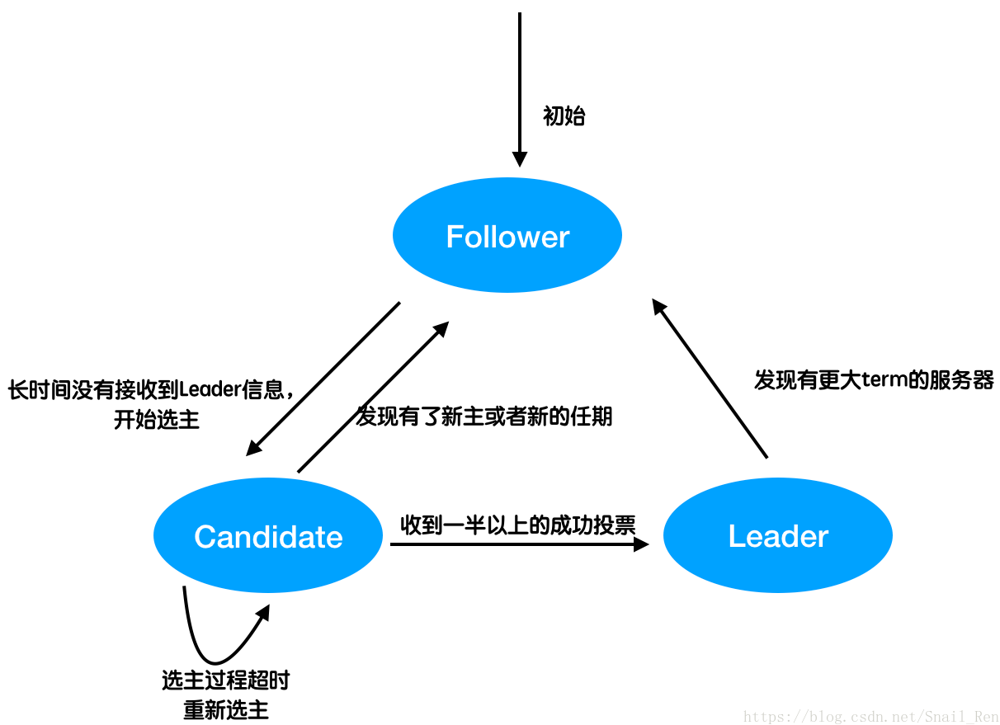
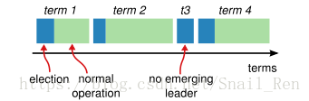

### Raft 算法详解

- [算法动画](http://thesecretlivesofdata.com/raft/)
- 概述
   - 实现多个子功能
      - Leader 选举 （Leader election）
      - 日志同步模块 （Log replication）
      - 安全性模块（Safety）
      - 日志压缩（Log compaction）
      - 成员变更（Membership change）
   - 系统角色
      - 领导者 Leader 
      - 跟随者 Follower 
      - 候选人 Candidate 
   - Leader 的数量
       - Raft **要求系统在任意时刻最多只有一个Leader！**
       - 如果Follower超时没有收到Leader的消息，它会成为一个Candidate并且开始一次Leader选举
       - 收到大多数服务器投票的Candidate会成为新的Leader。Leader在宕机之前会一直保持Leader的状态。
- leader 选举
    - 选举方法
        - Raft 使用心跳（heartbeat）触发Leader选举。当服务器启动时，初始化为Follower。Leader向所有Followers周期性发送heartbeat。如果Follower在选举超时时间内没有收到Leader的heartbeat，就会等待一段随机的时间后发起一次Leader选举
    - 选举完成的**三种**情况
        - 赢得了多数的选票，成功选举为Leader；
        - 收到了Leader的消息，表示有其它服务器已经抢先当选了Leader；
        - 没有服务器赢得多数的选票，Leader选举失败，等待选举时间超时后发起下一次选举。
***

#### 选举完整过程

 我们在Raft协议详解（一） 中讲到。Raft协议会将需要保证一致性的数据保存在多台服务器上，集群中存在该数据的多个副本。

      那么问题来了。客户端不会向集群中的每台服务器都发送一次数据，他只会向其中某一台发送数据，那么应该发送给谁？另外，集群中多台服务器上的数据，可能由于网络、丢包、宕机等等问题，导致同一数据的不同副本不一样，那么以谁的为准等等问题。其实在Raft中，只要了解raft中各种角色状态就可以回答上面的问题了。

***

##### Raft基本定义

      在介绍后面的内容之前，我们先进行一些Raft中的一些名词定义，以保证我们在说一下名词的时候知道什么意思。

##### 服务器角色

      在Raft的设计中，只将集群中的服务器设计为三种状态，分别是跟随者follower、候选者candidate、领导leader。同一台服务器，可以在三种不同状态之间进行转换。接下来分别对以上三个角色的作用进行介绍。 
      

上图中为三种状态之间的转换图。详细的我会在后面进行再介绍。现在也只是看个大概就行了。所有的服务器在刚开始的时候都是跟随者follower。一般情况下大部分服务器都处于follower状态。跟随者可以理解为master-slave结构中的slave，就像是将军领导下的小兵。follower不会主动向集群发起消息。leader负责对整个集群进行控制管理，同时接受客户端的请求。在整个集群中，不能同时出现多个leader，任何时刻只会有一个或者没有。candidate就是处于选主阶段的状态，要么选举成功成为leader，要么退回到follower。

##### 任期term

      在Raft中，是以任期term来作为逻辑时钟的，在实现时可以为整型数字，如1,2,3,4……。任期是指一台服务器成为leader的期间。随着时间的推移，leader会由不同的服务器来担当。在上图中，有4个任期。蓝色部分为该任期中进行投票选主的时间，绿色为该任期中担任leader的时间。一个term中不会出现两个以及以上的leader。t3是表示进行了leader选取，但是选取失败了，进入term4重新选举。

#### 选主过程
##### 选主触发
      leader为了保证与其他成员保持通讯，以及监控其他成员可用性，会发送心跳通信。follower也通过心跳来知道leader还“活着”，处于可用状态。但是follower也是很躁动的，一旦发现一个周期内没有接收到leader的心跳了，那么就认为leader已经凉了。那follower就想自己做领导，它会立刻让自己进入候选者状态（Candidate），并进行“夺权”操作，触发选主过程。

##### 选主过程
      一旦follower要开始选主了，那么就进入了candidate状态。Raft选主还是以“少数服从多数”作为基本思想，因此进入candidate要做的第一件事就是获得集群中其他机器的赞同票。candidate会首先把自己的term +1，然后将自己的term装入RequestVote RPC中，发送给集群中其他机器。同时自己也投自己一票。

      在发起投票后，存在这么几种可能性：

1. 收到了一半以上的赞同票 

candidate在发出了投票请求后，收到了其他服务器的投票反馈。如果超过一半的服务器都投了赞成，那么candiate则选主成功，转为leader状态。选主结束。转为leader后会立马向集群中其他机器发送选主结果，并且进行作为leader的其他工作，如日志复制等。
在等待最终结果的过程中收到了一个leader的消息 

2. candidate在等待最终投票结果的过程中，突然收到了一个leader的消息。该消息中包含了leader的term。此时candidate会将该term与自身term进行比较。如果该消息的term大于自身term，则说明该leader是合法的，那么candidate就“起义”失败，退回follower状态，并将自身term设置为该leader的term。如果该消息的term小于自身term，则说明该leader无效，则返回否定信号，并将自己的term传给他。

3. 一段时间后没有产生leader 

在经过了设定的一段时间周期后，发现leader并没产生，或者投票还未超过一半。此时则会结束投票选举过程，随机等待一段时间后再次重新发起选主投票。因为可能集群中几个服务器都同时发起了投票请求，大家谁也不投谁，造成了死锁了。所以只需要随机等待一段时间后再重新发起投票请求就好了。

##### follower
      follower在运行的过程中，若收到了RequestVote RPC投票请求，则会判断。如果收到的消息中的term比自己的小，那么会投反对票。如果比他的大，或者相同，并且candidate的日志与自己的一样新的话，那么就投出赞成票。（关于日志问题，后面再详细解释）
